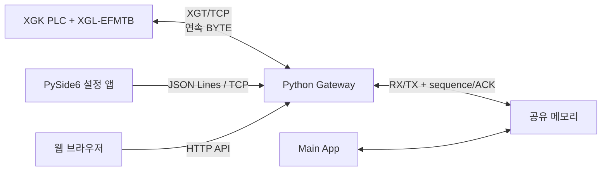

# XGT Shared Memory Gateway

LS ELECTRIC XGT 전용통신의 **연속 BYTE 읽기/쓰기**를 이용해 기본 PLC 데이터 200바이트(100워드)를 공유 메모리와 교환하는 프로그램입니다. Windows 10/11과 Ubuntu 계열 Linux에서 같은 Python 소스로 동작합니다.

## 포함 구성

| 구성 | 역할 | 의존성 |
|---|---|---|
| `gateway.py` | PLC 통신, 공유 메모리, TCP 설정 서버, 웹 서버 | Python 3.10+ 표준 라이브러리만 사용 |
| `config_client.py` | TCP로 Gateway를 원격 설정하는 PySide6 GUI | PySide6 6.8.x |
| 웹 설정 화면 | 브라우저에서 PLC/주기/주소/재시도/공유 메모리 설정 | 별도 설치 없음 |
| `tools/plc_simulator.py` | 실 PLC 없이 연속 읽기/쓰기 시험 | 별도 설치 없음 |
| `tests/` | 프로토콜·공유 메모리·TCP 왕복 자동 검증 | `unittest` |



## 가장 빠른 실행 방법

### Windows

1. Python 3.10 이상을 설치하면서 **Python Launcher (`py`)**를 포함합니다.
2. `run_gateway.bat`을 실행합니다.
3. 브라우저에서 `http://127.0.0.1:5051`을 열어 상태와 설정을 확인합니다.
4. 별도 설정 PC에서는 폴더를 복사한 뒤 `run_config_client.bat`을 실행하고 Gateway PC의 IP, TCP Port `15150`으로 접속합니다. 저장된 설정이 있으면 그 포트를 사용합니다.

### Linux

```bash
chmod +x run_gateway.sh run_config_client.sh
./run_gateway.sh
```

GUI가 없는 서버에서는 Gateway와 웹 화면만 사용하면 됩니다. PySide6 앱은 데스크톱 환경이 있는 PC에서 실행하고 TCP로 서버에 접속할 수 있습니다.

## 기본 동작

- PLC 접속 예: `192.168.0.10:2004` - 실제 XGL-EFMTB의 XGT 서버 Port에 맞춰 변경합니다.
- 읽기: `D1000`부터 200바이트(100워드), 50ms 주기
- 쓰기: `D1100`부터 200바이트(100워드), 첫 TX 커밋 이후 50ms 주기로 전송 (`cyclic`)
- 공유 메모리: `xgt_gateway_v1`, 총 512바이트
- TCP 설정 서버: `0.0.0.0:15150`
- 웹 설정 서버: `0.0.0.0:5051`

기존 `config.json`과 GUI에 저장된 접속 정보는 유지됩니다. Core와 통합할 때는 Gateway와 Core의 실제 TCP 포트가 일치해야 합니다. PLC 영역은 Gateway에서 설정하고 Core가 조회합니다.

`D1000`처럼 워드 주소를 입력하면 매뉴얼 규칙에 따라 연속 BYTE 주소 `%DB2000`으로 자동 변환됩니다. `%DB2000`을 직접 입력해도 됩니다.

## PLC 쓰기 안전 동작

기본값 `write_on_startup=false`에서는 새 커밋이 없으면 Gateway 시작만으로 0값이나 이미 ACK된 값을 PLC에 쓰지 않습니다. 시작 전에 커밋됐지만 ACK되지 않은 요청은 전송합니다. `cyclic` 모드는 첫 커밋 이후 주기적으로 전송하며, `on_change`는 새 sequence만 전송합니다.

1. 외부 앱이 TX 버퍼에 설정된 쓰기 길이(기본 200바이트)만큼 기록합니다.
2. TX sequence를 홀수 → 데이터 복사 → 짝수 순서로 커밋합니다.
3. Gateway가 새 짝수 sequence를 확인하고 PLC에 씁니다.
4. PLC ACK 수신 후 `write_ack_sequence`를 같은 값으로 갱신합니다.

파이썬 앱에서는 아래처럼 헬퍼를 쓰면 됩니다.

```python
from xgt_gateway.shared_memory_bridge import SharedMemoryClient

with SharedMemoryClient("xgt_gateway_v1") as memory:
    plc_data = memory.read_plc_data()       # PLC -> 공유 메모리
    sequence = memory.write_plc_data(bytes(int(memory.layout()["write_length"])))  # 공유 메모리 -> PLC 커밋
```

자세한 레이아웃은 [docs/SHARED_MEMORY.md](docs/SHARED_MEMORY.md)를 참고하세요.

## 설정 방법

### 웹

브라우저에서 PLC IP/Port, 읽기·쓰기 주소 및 주기, 재연결 지연, 공유 메모리 이름/크기/Offset, 웹 서버 상태를 변경할 수 있습니다. 설정은 검증 후 `config.json`에 원자적으로 저장되고 즉시 적용됩니다.

### PySide6 TCP 앱

`run_config_client.bat` 또는 `run_config_client.sh`로 실행합니다. 웹 서버가 꺼진 상태에서도 TCP 설정 서버로 접속해 웹을 다시 켤 수 있습니다.

### JSON 파일

Gateway가 꺼진 상태에서 `config.example.json`을 참고해 `config.json`을 직접 수정할 수도 있습니다. TCP 설정 서버 자체의 bind 주소/Port를 바꾸면 Gateway 재시작이 필요합니다.

## 실 PLC 없이 확인

터미널 1:

```bash
python tools/plc_simulator.py --host 127.0.0.1 --port 2004
```

웹 또는 PySide6 앱에서 PLC IP를 `127.0.0.1`, Port를 `2004`로 설정합니다. 시뮬레이터의 D BYTE 영역은 `00 01 02 ... FF` 반복 패턴으로 초기화됩니다.

자동 테스트:

```bash
PYTHONPATH=src .venv-linux/bin/python -m unittest discover -s tests -v
```

Windows PowerShell에서는 ` $env:PYTHONPATH='src'; python -m unittest discover -s tests -v `를 실행합니다.

## 방화벽과 보안

- 원격 PySide6 앱 사용 시 Gateway PC의 TCP `15150`(실제 설정 포트)을 허용합니다.
- 원격 웹 사용 시 TCP `5051`(실제 설정 포트)을 허용합니다.
- 제어 TCP와 HTTP는 TLS를 내장하지 않았습니다. **설비 내부망에서만 사용**하고, 외부망에서는 VPN 또는 TLS reverse proxy 뒤에 배치하세요.
- TCP/HTTP 설정 API는 인증 토큰을 요구하지 않습니다. 외부망에 직접 노출하지 말고 설비 내부망, 전용망, VPN 안에서 사용하세요.

## 문서

- [XGT 프레임 및 주소 규칙](docs/XGT_PROTOCOL.md)
- [TCP 설정 프로토콜과 HTTP API](docs/CONTROL_PROTOCOL.md)
- [공유 메모리 레이아웃](docs/SHARED_MEMORY.md)
- [Windows/Linux 서비스 운용](docs/DEPLOYMENT.md)
